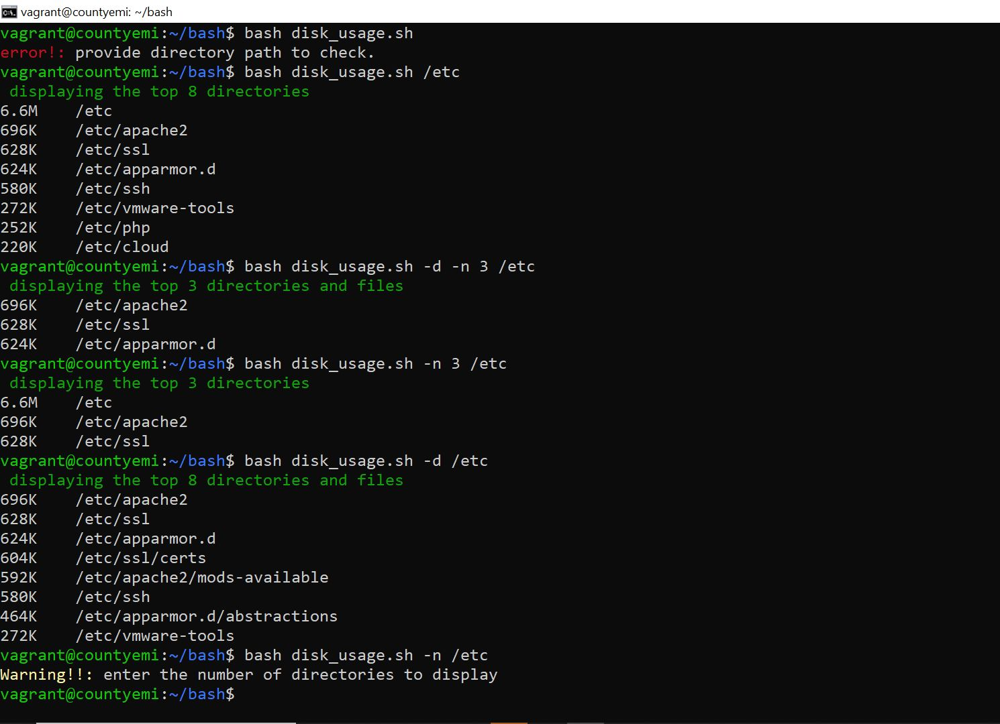
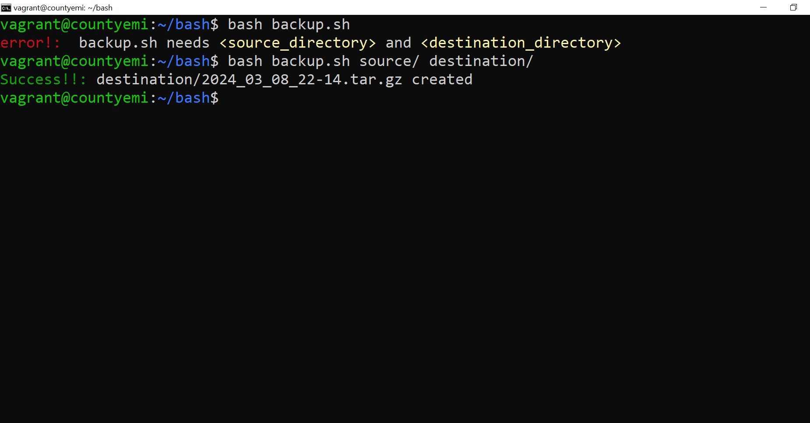

<h1> disk_usage script</h1>

The disk usage script checks for directory and file sizes in the path provided.

<ul> 
  <li>it takes one compulsory argument. "the directory path" and</li>
<li>two optional arguments "-n" and "-d"</li>
  
"-n" is followed by an integer which specifies the top N directories to display

  
if "-n" is not passed in the command line argument, default is 8

  
 If "-d" is passed, then list of directories and files should be displayed. if not, only directories should be displayed

</ul>

this is the test case for the diskusage script 

<h1>backup script</h1>

the back up script takes two arguments.

<ul>
  <li>source and</li>
  <li>destination path</li>
</ul>

it creates a backup of the source with the destination and timestamp

it also creates a tar file of the back up. It checks for the installation of tar on the host machine before creating the backup and installs it if it is not available

this is the test case for the backup script 
